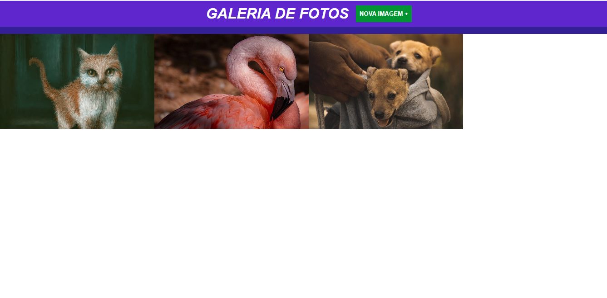
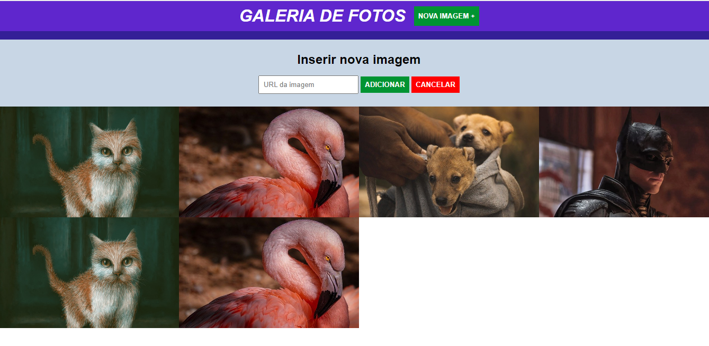

# 🛠 Tecnologias utilizadas:
 

  

  
   
  
  
   

 

# 💻  Sobre o Projeto:
<li>No nono módulo do curso de Engenheiro Front-End oferecido pela EBAC, tivemos a introdução ao jQuery, uma biblioteca de funções do JavaScript que interage com páginas HTML, projetada para simplificar scripts a serem executados/interpretados no navegador de Internet do usuário. Como exercício durante este módulo, tivemos como desafio a criação de uma galeria de fotos onde o usuário pode adicionar uma imagem a partir da URL da mesma. Usando o Adobe Color, selecionei uma paleta de cores mais elegante e simplista e importei a fonte Jost do Google. Ao clicar no botão de "Nova Imagem +" , é exibido um novo campo com efeito deslize para baixo para que o usuário possa adicionar uma nova imagem. Após colar a URL da imagem no campo pretendido, o usuário deve clicar no botão "Adicionar"e cada imagem será inserida abaixo da lista de imagens existentes. Caso o usuário desista da ação, basta clicar no botão "Cancelar" que o campo será removido da tela com o efeito Slide Up.  

Link so site: https://jquery-galeria-eight.vercel.app/</li>
 

# 🎨 Pré-visualização :
## Apresentação da Página:

## Inclusão de uma nova imagem:

## Imagens adicionadas:

# 🦸 Autor:

 
<a href="https://www.linkedin.com/in/jo%C3%A3o-vitor-ribeiro-dias-339a56258/" target="_blank">João Vitor RIbeiro Dias</a>
